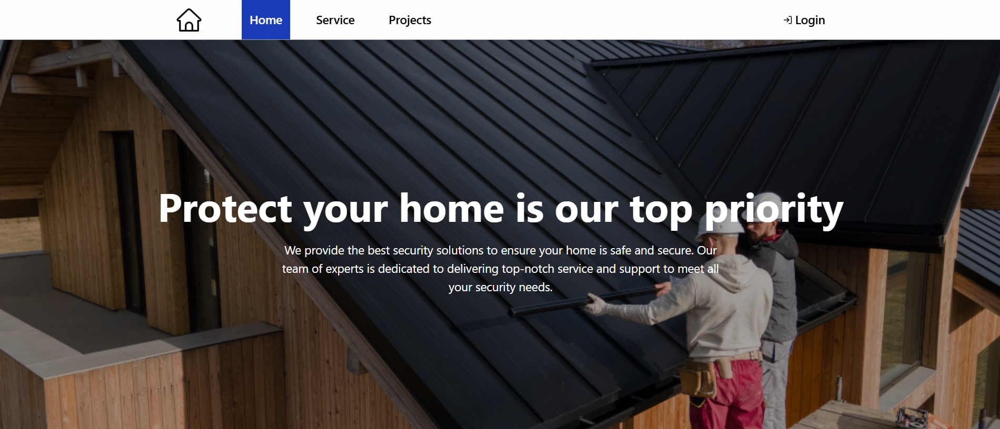

# Tailwind CSS Project

A practice project to explore and implement [Tailwind CSS](https://tailwindcss.com/) in a modern React application. The project demonstrates responsive layouts, reusable components, and integration with Vite for fast development.

## Features

- **Tailwind CSS** for utility-first styling
- **Vite** for fast development and build
- **React Router v7** for client-side routing
- **Lucide React** icons
- Responsive design with modern UI patterns
- Example pages: Home, Services, Projects, Login
- Reusable components: Navbar, Footer, Cards, Forms

## Contributors:

## Contact:

_For any questions or feedback, please contact:_

**Ravikant Tarare**

📩 [ravikanttarare2001@gmail.com](mailto:ravikanttarare2001@gmail.com)

📞 [8275957698](tel:8275957698)